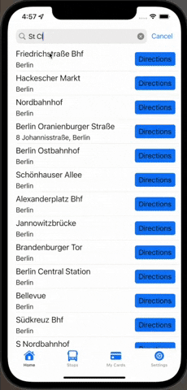
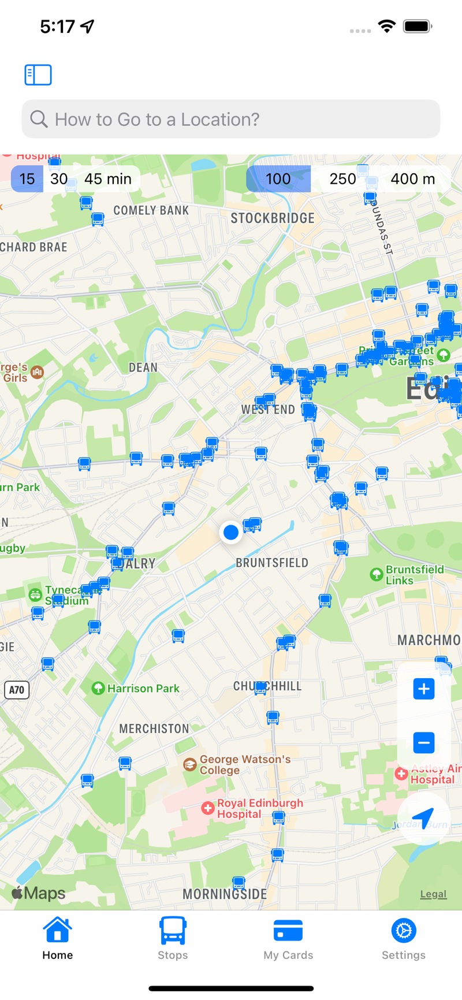
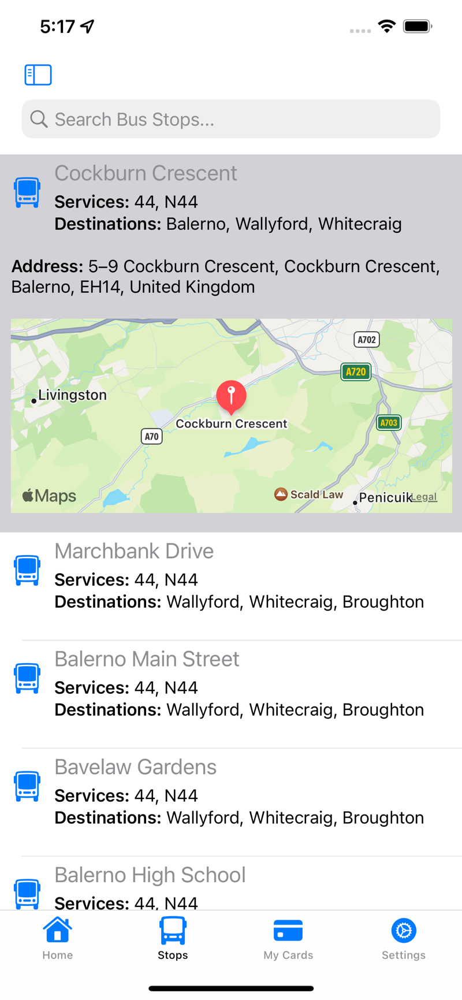
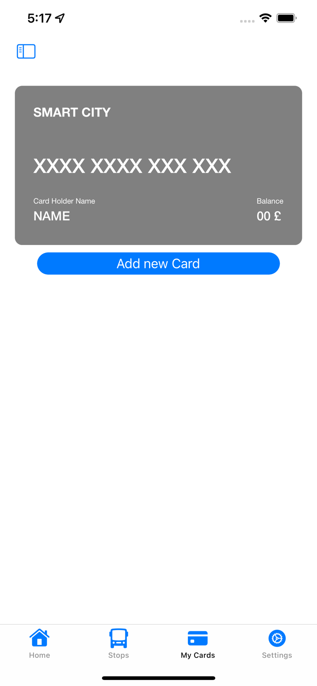
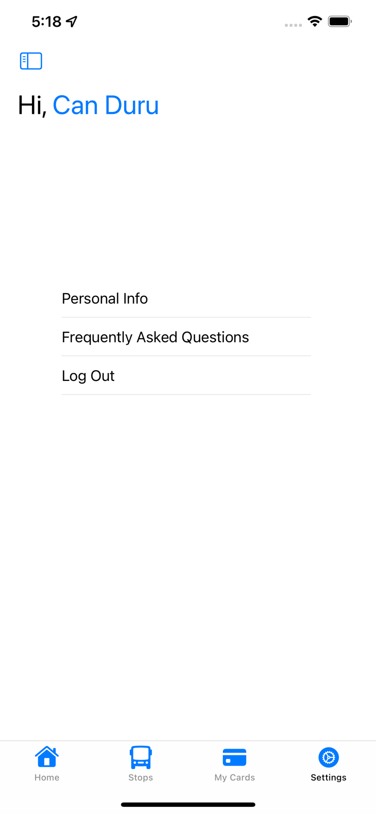
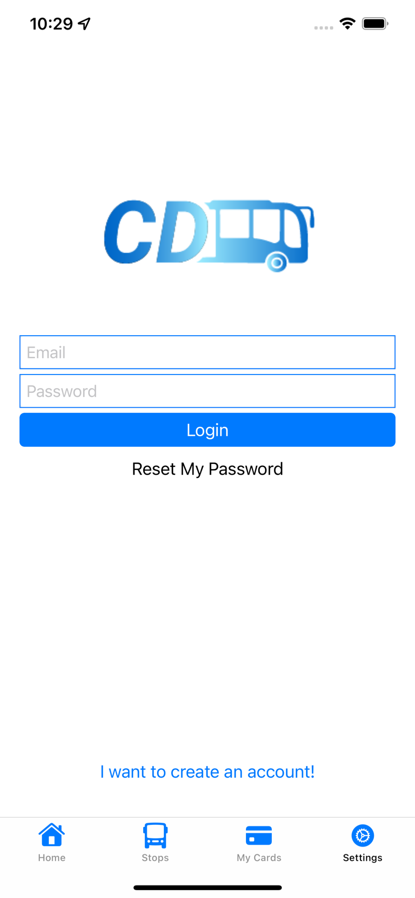
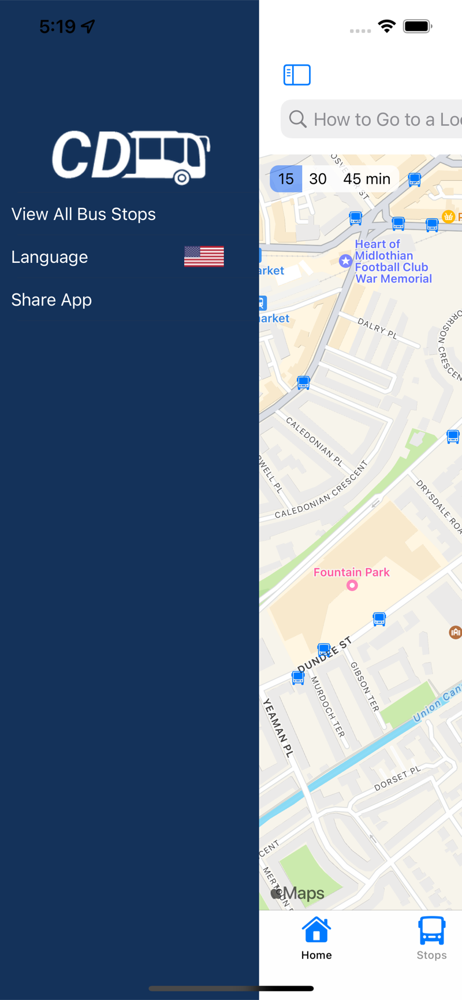

# Smart City: Edinburgh

[](https://swift.org/)
[](https://developer.apple.com/documentation/uikit)
[](https://developer.apple.com/ios/)
[](https://cocoapods.org/)
[](LICENSE)

Smart City: Edinburgh is an iOS public-transport app for Edinburgh built with Swift and UIKit. It combines map browsing and place search with live bus positions, stop search and journey planning, Firebase accounts, and NFC tag scanning for travel cards. The original version dates from 2022; it was brought up to date for current Xcode and iOS in September 2026. Live transit features are currently unavailable because the original Transport for Edinburgh open-data API has closed and a replacement is not yet integrated (see [docs/OPERATIONS.md](docs/OPERATIONS.md)).

<p align="center">
  
</p>

The Xcode project, workspace and app target are still named `Asis`, the project's original working title.

## Features

- Map browsing and place search
- Live bus positions, stop search and journey planning when the configured transit API is available
- Firebase email/password accounts and personal information
- NFC tag identifier scanning on supported physical iPhones (a tag identifier is not a bank card number or proof of a transport balance)
- Localized strings for English, German, Spanish, French, Russian, Turkish and Simplified Chinese

## Tech stack

| Layer | What is used |
| --- | --- |
| Language / UI | Swift 5, UIKit (programmatic layout, no main storyboard) |
| Maps and location | MapKit, CoreLocation |
| Hardware | CoreNFC (tag identifiers) |
| Networking | Alamofire and Codable response models |
| Backend | Firebase Auth, Cloud Firestore, Analytics |
| Local storage | Core Data (`Asis.xcdatamodeld`) |
| UI components | SideMenu, FloatingPanel |
| Dependencies | CocoaPods 1.16.2 (`Podfile.lock` committed); root `Package.swift` for pure Swift logic tests only |

## Getting started

### Prerequisites

- macOS with Xcode 26.2 or later (verified with Xcode 27.0)
- iOS 15.6 or later on a simulator or device
- CocoaPods 1.16.2 and a current Ruby installation
- A physical iPhone with NFC and the NFC Tag Reading capability for NFC testing

### Installation

1. Clone the repository and install pods.

   ```bash
   git clone https://github.com/CanDuru4/smart-city-edinburgh.git
   pod install --project-directory=smart-city-edinburgh
   ```

2. Open `Asis.xcworkspace` (not the `.xcodeproj`, because CocoaPods is still in use).
3. Select the `Asis` scheme and an iPhone simulator. For a physical device, select your development team in Signing & Capabilities and enable NFC Tag Reading for your app identifier.

Use `pod install` for repeatable setup; use `pod update` only for an intentional dependency upgrade.

### Configuration

| Setting | Where | Purpose |
| --- | --- | --- |
| `GoogleService-Info.plist` | `Asis/GoogleService-Info.plist` (git-ignored) | Firebase accounts. Without it, maps still work and account features show an unavailable state. |
| `FIREBASE_CONFIG_PATH` | Xcode build setting | Overrides the Firebase config source path, for CI or configuration-free testing |
| `TransitAPIBaseURL` | `Asis/Info.plist` | HTTPS base URL of the transit API |

Provider status, Firebase rules expectations and NFC details are in [docs/OPERATIONS.md](docs/OPERATIONS.md).

## Project structure

```
Asis/
├── AppDelegate.swift, SceneDelegate.swift, TabBarViewController.swift
├── Home/          Map screen, floating panel, route search
├── BusStops/      Stop list and stop detail cells
├── Card/          NFC card reader and the custom credit-card view
├── Settings/      Auth (login / sign up), personal info, FAQ
├── SideMenu/      Side menu, all-stops list, system language settings
├── Data/          Transit API client, Codable models, Firebase profiles
├── Domain/        Pure transit-time and NFC identifier calculations
├── Helper/        Network reachability, location manager, annotations, loading UI
├── Translation/   Localizable.strings for en, de, es, fr, ru, tr, zh-Hans
└── Assets.xcassets
Asis.xcworkspace/  CocoaPods workspace to open
Asis.xcodeproj/    Xcode project
Tests/             Pure Swift, app unit, and UI tests
Package.swift      Pure Swift calculation tests only
Podfile, Podfile.lock
docs/              Operations notes; docs/assets holds README images
Images/            Logo artwork
CHANGELOG.md       Release history
```

## Testing

Run the pure Swift regression tests from the repository root:

```bash
swift test
```

Build without a signing account:

```bash
xcodebuild -workspace Asis.xcworkspace -scheme Asis \
  -destination 'generic/platform=iOS Simulator' \
  -derivedDataPath DerivedData CODE_SIGNING_ALLOWED=NO build
```

Run the app unit tests and screen-flow tests against an installed simulator:

```bash
xcodebuild -workspace Asis.xcworkspace -scheme Asis \
  -destination 'platform=iOS Simulator,id=YOUR_SIMULATOR_UDID' \
  -derivedDataPath DerivedData CODE_SIGNING_ALLOWED=NO test
```

The dated verification record and manual checks are in [docs/OPERATIONS.md](docs/OPERATIONS.md). There is no CI.

## Deployment

There is no automated build or release workflow; builds and archives are produced from Xcode.

## Screenshots

Original application screenshots (2022):

<p align="center">
  
  
  
</p>

<p align="center">
  
  
  
</p>

## Known limitations

- Live vehicles, the complete stop list and in-app timetables are unavailable until a replacement for the closed Transport for Edinburgh API is integrated.
- NFC scanning reads tag identifiers only; it does not show real travel-card balances.
- iPad runs in iPhone compatibility mode; there is no native iPad layout.
- Firebase is ending new CocoaPods releases in October 2026, so a future migration to Swift Package Manager is needed for Firebase updates.

## Acknowledgments

Thanks to the Transport for Edinburgh Open Data API, which powered the original transit features.

## License

MIT. See [LICENSE](LICENSE).

## Author

Can Duru — [canduru.net](https://canduru.net)
